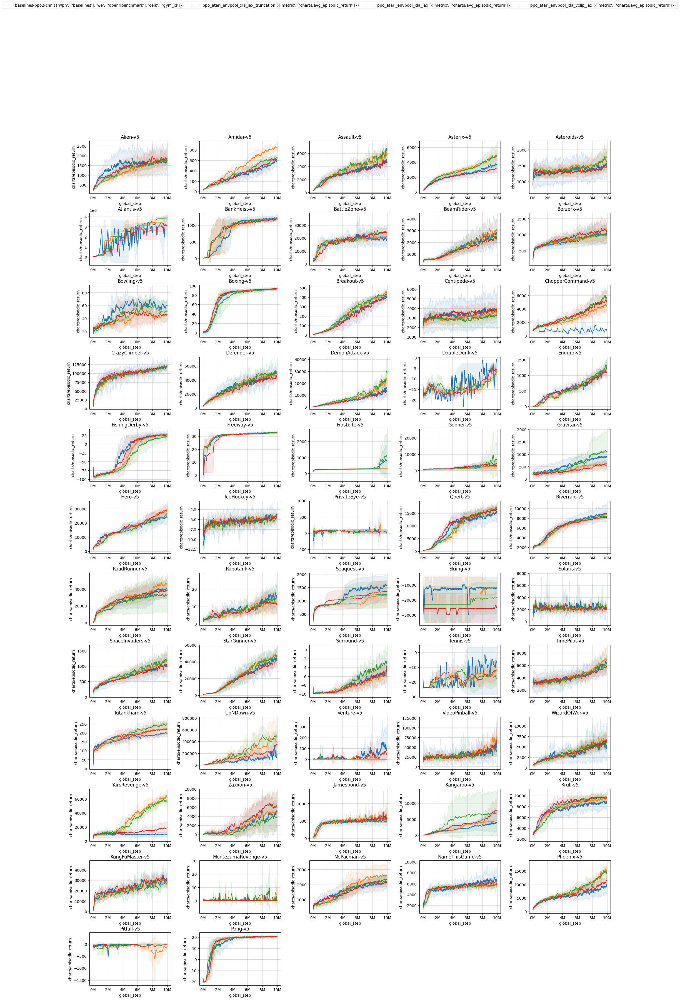

# PPO Atari metrics


## Get started

To test it out the basic functions, run the following commands:

```
poetry install
python rlops.py --wandb-project-name envpool-atari \
    --wandb-entity openrlbenchmark \
    --filters 'baselines-ppo2-cnn?wpn=baselines&we=openrlbenchmark&ceik=gym_id' 'ppo_atari_envpool_xla_jax_truncation?metric=charts/avg_episodic_return' 'ppo_atari_envpool_xla_jax?metric=charts/avg_episodic_return' 'ppo_atari_envpool_xla_vclip_jax?metric=charts/avg_episodic_return' \
    --env-ids Alien-v5 Amidar-v5 Assault-v5 \
    --output-filename compare.png --report
```

The `rlops.py` utility is directly taken from https://github.com/vwxyzjn/cleanrl/pull/307 with a minor hack. 

The filters correspond to the following set of experiments:

* `baselines-ppo2-cnn?wpn=baselines&we=openrlbenchmark&ceik=gym_id` corresponds to the runs from `openai/baselines`' PPO2 under the standard setting.
    * ⚠️ most experiments here use atari-py@0.2.6, which does not have `Surround` and hangs on `gym.make("DefenderNoFrameskip-v4")`, so for those two environments we use ale-py@0.7.5 (we also hack it to make `SurroundNoFrameskip-v4` available using the same confirguration for other v4 games, where ale-py has only `Surround-v5`).
* `ppo_atari_envpool_xla_jax_truncation?metric=charts/avg_episodic_return` corresponds to the runs from CleanRL's PPO + JAX + EnvPool's XLA interface that properly handles value estimation on truncated states [vwxyzjn/cleanrl#311](https://github.com/vwxyzjn/cleanrl/pull/311)
    * ⚠️ handle value estimations according to https://github.com/sail-sg/envpool/issues/194#issuecomment-1298884741
* `ppo_atari_envpool_xla_jax?metric=charts/avg_episodic_return` corresponds to the runs from CleanRL's PPO + JAX + EnvPool's XLA interface [docs](https://docs.cleanrl.dev/rl-algorithms/ppo/#ppo_atari_envpool_xla_jaxpy)
    * ⛔️ bug: envpool's vectorized environment is not exactly compatible with `openai/baselines`' vectorized environment, which causes an off by one observation error. See [docs](https://docs.cleanrl.dev/rl-algorithms/ppo/#ppo_atari_envpool_xla_jaxpy)
* `ppo_atari_envpool_xla_vclip_jax?metric=charts/avg_episodic_return` corresponds to the runs from CleanRL's PPO + JAX + EnvPool's XLA interface that implements value function clipping like done in `openai/baselines`' PPO2
    * ⛔️ bug: envpool's vectorized environment is not exactly compatible with `openai/baselines`' vectorized environment, which causes an off by one observation error. See [docs](https://docs.cleanrl.dev/rl-algorithms/ppo/#ppo_atari_envpool_xla_jaxpy)

Learning curves: the `compare.png` shows the learning curves which subsamples 10000 data points and and interpolate. The curves are smoothed by a rolling average with a window size 100 and their shaded region represents the standard deviation.

Result table: the `result_table.md` shows the average episodic return of the last 100 episodes. For each random seed $i$ (we have 3 random seeds for each set of experiments), we calculate the average episodic return of the last 100 training episodes as $a_i$. We then average the $a_i$'s over all random seeds to get the final average episodic return and report its standard deviation. This type of evaluation is known as an implicit evaluation method ([Machado et al., 2017](https://arxiv.org/pdf/1709.06009.pdf)) which aligns better with the general goal of RL which is continual learning. This method also detects issues with catastrophic forgetting compared to the evaluation method that evalutes the best model.

* For runs that use the XLA interface (e.g, `ppo_atari_envpool_xla_jax`, `ppo_atari_envpool_xla_jax_truncation`, `ppo_atari_envpool_xla_vclip_jax`), we report using the last 100 recorded "data points" which corresponds to the last 100 * 8 * 128 = 102400 steps, where 8 is the number of environments, 128 is the number of steps in the rollout phase. Due the limitation XLA, each "data point" is the average of the *latest episodic returns* of the 8 environments during training after each rollout phase, and the data points could be stale or have been updated several times. This means we are reporting the average episodic return of an unknown number of episodes.


## Get complete metrics

By default wandb subsamples 500 datapoints from the runs, which may not be enough to get a good estimate of the learning curve. To get the complete metrics, run the following commands which toggles `--scan-history` (note that this may take a while):

```
python rlops.py --wandb-project-name envpool-atari \
    --wandb-entity openrlbenchmark \
    --filters 'baselines-ppo2-cnn?wpn=baselines&we=openrlbenchmark&ceik=gym_id' 'ppo_atari_envpool_xla_jax_truncation?metric=charts/avg_episodic_return' 'ppo_atari_envpool_xla_jax?metric=charts/avg_episodic_return' 'ppo_atari_envpool_xla_vclip_jax?metric=charts/avg_episodic_return'  \
    --env-ids Alien-v5 Amidar-v5 Assault-v5 Asterix-v5 Asteroids-v5 Atlantis-v5 BankHeist-v5 BattleZone-v5 BeamRider-v5 Berzerk-v5 Bowling-v5 Boxing-v5 Breakout-v5 Centipede-v5 ChopperCommand-v5 CrazyClimber-v5 Defender-v5 DemonAttack-v5 DoubleDunk-v5 Enduro-v5 FishingDerby-v5 Freeway-v5 Frostbite-v5 Gopher-v5 Gravitar-v5 Hero-v5 IceHockey-v5 PrivateEye-v5 Qbert-v5 Riverraid-v5 RoadRunner-v5 Robotank-v5 Seaquest-v5 Skiing-v5 Solaris-v5 SpaceInvaders-v5 StarGunner-v5 Surround-v5 Tennis-v5 TimePilot-v5 Tutankham-v5 UpNDown-v5 Venture-v5 VideoPinball-v5 WizardOfWor-v5 YarsRevenge-v5 Zaxxon-v5 Jamesbond-v5 Kangaroo-v5 Krull-v5 KungFuMaster-v5 MontezumaRevenge-v5 MsPacman-v5 NameThisGame-v5 Phoenix-v5 Pitfall-v5 Pong-v5 \
    --output-filename compare.png --scan-history
```

⚠️ if you want to generate wandb report, you have to separate them to two differnt reports otherwise wandb report could crash.
```
python rlops.py --wandb-project-name envpool-atari \
    --wandb-entity openrlbenchmark \
    --filters 'baselines-ppo2-cnn?wpn=baselines&we=openrlbenchmark&ceik=gym_id' 'ppo_atari_envpool_xla_jax_truncation?metric=charts/avg_episodic_return' 'ppo_atari_envpool_xla_jax?metric=charts/avg_episodic_return' 'ppo_atari_envpool_xla_vclip_jax?metric=charts/avg_episodic_return'  \
    --env-ids Alien-v5 Amidar-v5 Assault-v5 Asterix-v5 Asteroids-v5 Atlantis-v5 BankHeist-v5 BattleZone-v5 BeamRider-v5 Berzerk-v5 Bowling-v5 Boxing-v5 Breakout-v5 Centipede-v5 ChopperCommand-v5 CrazyClimber-v5 Defender-v5 DemonAttack-v5 DoubleDunk-v5 Enduro-v5 FishingDerby-v5 Freeway-v5 Frostbite-v5 Gopher-v5 Gravitar-v5 Hero-v5 IceHockey-v5 PrivateEye-v5 Qbert-v5 Riverraid-v5  \
    --output-filename compare.png --scan-history --report
```
```
python rlops.py --wandb-project-name envpool-atari \
    --wandb-entity openrlbenchmark \
    --filters 'baselines-ppo2-cnn?wpn=baselines&we=openrlbenchmark&ceik=gym_id' 'ppo_atari_envpool_xla_jax_truncation?metric=charts/avg_episodic_return' 'ppo_atari_envpool_xla_jax?metric=charts/avg_episodic_return' 'ppo_atari_envpool_xla_vclip_jax?metric=charts/avg_episodic_return'  \
    --env-ids RoadRunner-v5 Robotank-v5 Seaquest-v5 Skiing-v5 Solaris-v5 SpaceInvaders-v5 StarGunner-v5 Surround-v5 Tennis-v5 TimePilot-v5 Tutankham-v5 UpNDown-v5 Venture-v5 VideoPinball-v5 WizardOfWor-v5 YarsRevenge-v5 Zaxxon-v5 Jamesbond-v5 Kangaroo-v5 Krull-v5 KungFuMaster-v5 MontezumaRevenge-v5 MsPacman-v5 NameThisGame-v5 Phoenix-v5 Pitfall-v5 Pong-v5 \
    --output-filename compare.png --scan-history --report
```

## Generated results



